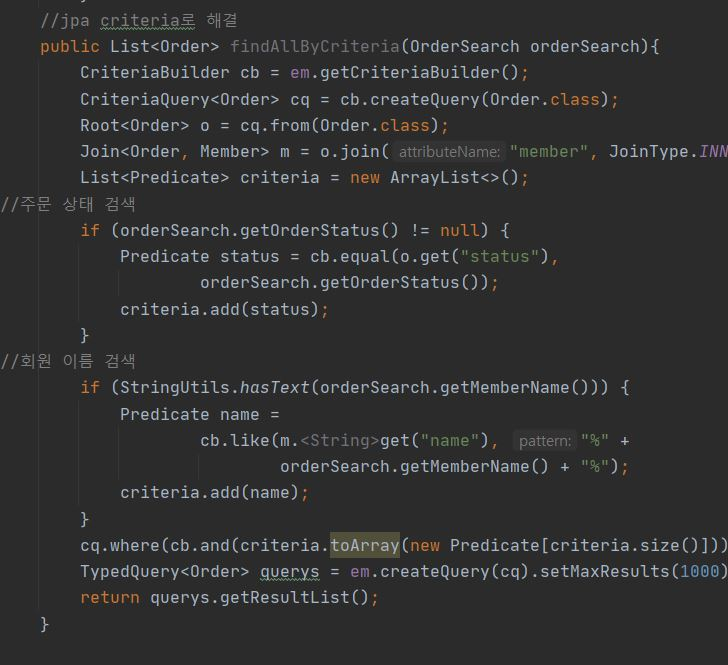

# 프로젝트 생성
- start.io로 프로젝트 생성
- 

## Lombok 추가
- Preferences -> plugin에서 롬복 설치 
- 임의의 테스트 클래스 만들고 @Getter, @Setter로 동작 확인
- 
- 

## View 환경 설정

### Thypleaf
- 요즘 jpa 대신 프리마커, 그루비, thymleaf를 씀
- Thypleaf 장점
  - 마크업을 깨지 않고 그대로 사용 가능
  - 웹브라우저에 바로 열림
- thypleaf 단점
  - 태그를 정확히 닫아주지 않으면 에러가 났으나 3.0으로 업그레이드 되고 개선됨
  - 메뉴얼을 보고 해야하는 단점이 있으나 익숙해지면 편함

### View 테스트(랜더링)

- 
- return에 쓰여있는 "hello"는 자동으로 hello.html과 매핑됨
- data에 "Hello!"값을 넘긴다는 의미
- 
- 
- 순수한 자바로 돌리면 "안녕하세요. 손님"이 출력되겠지만 Tomcat으로 돌리면 HelloController에서 값이 넘어와서 "안녕하세요. Hello!" 로 출력이 된다. 
  
- 
- 위 기능은 스프링 부트 thymleaf가 실행하는 기능. 

- 정적 컨텐츠는 static에 넣어두고 랜더링할 컨텐츠는 templates에 넣어주는게 좋다.  
  
- 그런데 한번 랜더링 된 상태에서 hello.html을 고쳐도 잘 안바뀐다. 이럴 때는 gradle에 라이브라리 devtools를 추가해준다.
- 

## JPA와 DB 설정
- 먼저 앞서 생성한 H2와 연결하기위한 Yaml파일을 생성한다
- 
- 
- 위의 db와 함께 jpa로 다루기 위한 객체 member를 생성한다.
- 
- @Entity를 통해 JPA로 다룰 객체라는 것을 명시해 주고, @id, @Generated를 이용하면 DB매핑을 위해 사용함을 알린다.
- 또 lombok을 통해 쉽게 @Getter, @Setter로 접근할 수 있게되었다.

- 
- 이제 db에 저장하고 조회할 수 있도록 memberRepository를 생성한다. 
- EntityManager는 JPA로 동작하는데, 스프링부트에서 자동으로 생성되는 것으로 이를 가져와서 사용할 수 있다. 이를 통해 객체들을 다룰 수 있다.
- persist()는 db에 넣을 수 있도록 해주고, find()는 db에서 조회할 수 있도록 해준다. 

- 
- 이제 제대로 매핑이 되는지 테스트하기위한 코드를 작성한다. 중요한 점은 @Transactional을 명시해주어야 JPA가 제대로 동작한 다는 것이다.
- 그러나 테스트 케이스에 Transactional이 있으면 성공하여도 rollback을 하기때문에 db에 반영되진않는다.@Rollback(False)를 써주면 반영된다. 

### 쿼리 남기기
- org.hibernate.type: trace를 yml에 추가하기
- 또는 p6spy 라이브러리를 추가

# 도메인 분석 설계

## 요구사항 분석
- 회원 등록 조회
- 상품 등록/수정/조회
- 주문 주문/조회/취소
- 상품은 재고관리가 필요하다
- 상품은 도서,음반 영화가 있다.
- 상품은 카테고리별로 구분할 수 있다
- 상품 주문 시 배송 정보를 입력할 수 있다.
  
- 
- - 참조) 1: 다 관계에서 외래키는 항상 다쪽에 있어 관계의 주인은 다쪽이다.

## 엔티티 클래스 개발

- 관계의 주인인 쪽에서 수정된 사항이 sql에 들어가짐. 주인이 아닌쪽은 값을 변경해도 sql에 반영되지 않음(mapped by로 된 부분)
- @Embeddable: 다른 엔티티의 일부로 저장될 수 있는 클래스를 의미함
- 외래키가 있는 부분이 주인이므로 JoinColumn(name = " ")
- 외래키가 없는 부분은 주인이 아니므로 @OneToMany (mappedBy= " ")
- 단방향에서는  한쪽은 정보를 알필요가 없으므로 한쪽에만 @JoinColum을 써준다.
- 1:1 관계에서도 외래키를 어디에 두든 가능하다. 하지만 Access를 많이 하는 곳에 두는것을 추천
- @Enumerated(EnumType.STRING): EnumType은 STRING, ORDINARY타입이 있는데, ORDINARY는 1,2,3 값으로 들어가기에 추후 추가되면 혼동이 발생할 수 있다. 따라서 무조건 STRING 타입으로!
- 다 대 다 테이블은 추천 x

### 설계 시 주의 점
- 가급적 Setter를 사용하지 말자. 유지보수가 어렵다
- 모든 연관간계는 지연 로딩으로 설정하라. (LAZY) (xxToOne)
- 컬랙션은 필드에서 초기화하자  
  - null로부터 안전
  - 하이버네이트는 엔티티를  영속화할때 하이버네이트가 제공하는 내장 컬랙션으로 변경하는데ㅡ 초기화를 안하면 오류가 날 수 있다  
  - 나중에 컬랙션을 함부로 바꾸면 안된다.
- 

## 회원 도메인 개발

### 회원 리퍼지터리 개발
- 
- @Repository를 통해 자동으로 스프링 빈 등록
- @PersistanceContext로 엔티티 매니저 생성, 인잭션 주입
- createQuery안에는 jpql을 사용. 이 쿼리는 sql과 문법이 약간다르다. sql은 테이블이 대상이라면 jpql은 엔티티가 대상임
  
### 회원 서비스 개발
- 리퍼지터리에서 em.persis(member)를 하게되면 영속성 컨텍스트가 됨. 이는 key가 매핑이됨. 항상 값이 key가 들어가있음. 그래서 db에 넣지 않아도 member.getId로 조회하면 항상 값이 있음
- MemberRepository 를 그냥 Autowored로 선언하면 나중에 변경이 힘듬 따라서 생성자 주입으로 만들어 주는게 좋다
- memberRepository를 final로 하여 외부에서 변경못하게 해준다
- 그냥 Autowired하고 생성자 주입을 직접 작성할 수도 있지만 롬복을 이용해 @AllArgumentConstructor로 해도되고 final필드만 가지고 생성자를 만들어주는 @RequoedArgsConstructor을 이용해도 된다.
- DB에서 읽기만 가능하게 해주도록 (readOnly =ture)로 하면 성능을 향상시킬 수 있다.
- 

- 앞서 작성한 멤버 리퍼지터리도 @RequiredArgsConstruct로 바꿀 수 있다.(em도 결국 생성자 주입을 스프링이 자동으로 해주는 것이기에)
- 

### 회원 기능 테스트
- 그런데 로그를 보면 Insert쿼리가 없는 것을 알 수 있는 데, persist()는 영속성 쿼리로 테스트에서 RollBack을 해서 db에 반영 되지 않는다. 따라서 로그를 통해 확인하고 싶으면 강제로 반영시키는 flush를 통해 확인하자.
- 
  
- 
- 예외처리를 할때 try catch문으로 작성해도 되고 @Test(expected)로 적어도 같은 기능이다.
- 예외가 발생하면 구문을 탈출하기 때문에 final로 안가고 오류가 발생한다. 따라서 맞는 오류를 잡는 구문을 써주어야한다.

- 테스트는 외부 디비보단 내부 디비를 써야 효율적이다. 이때를 위해 스프링에서 제공하는 db가 있다.
- main에 있는 yaml파일을 복사해서 test아래 resource를 만들고 그안에 넣으면 test에 있는 yaml이 test에서 별도로 동작한다. 따라서 여기서 db를 변경해준다.
- 
  
- 다른 방법은 스프링 부트에서 아무런 설정이 없으면 기본적으로 메모리 내부로 돌리기 떄문에 yml의 위에 내용을 주석처리해주면 된다.
- 

### 상품 도메인
- 
### 상품 리퍼지터리
- 
### 상품 서비스
- 

### 주문 도메인
- 
- 
### 주문 리퍼지토리
- 
### 주문서비스

- 
- order를 persist 하면  들어와있는 orderItems들도 강제로 persist된다. cascade옵션 때문
- delivery도 마찬가지
- 따라서 orderRepository만 save해도 orderItems와 delivery도 자동으로 저장된다.
- cascade는 관계의 private 주인인 경우에 사용해야함 라이프사이프도 동일한 경우가 좋다.

- 
- protected와 같은 기능으로 외부에서 맘대로 생성하지 못하게하는 기능

#### 주문 서비스

- 
- 

### 주문 테스트
-
-
-

### 주문 검색
- 여기서 두가지 방법을 다루는데 복잡하여 추천하지 않음. 가장 좋은 방법은 querydsl이다.
- jpql로 처리
-  

- JPA Criteria로 처리
- 

## 홈화면과 레이아웃

-  resource안에 template로 header, bodyheader, footer를 등록
-  yaml에 파일을 찾을 수 있도록 경로를 등록함
-  부트스트랩을 사용하기 위해 css, js파일을 받아 resources/static 폴더 안에 넣어준다. 